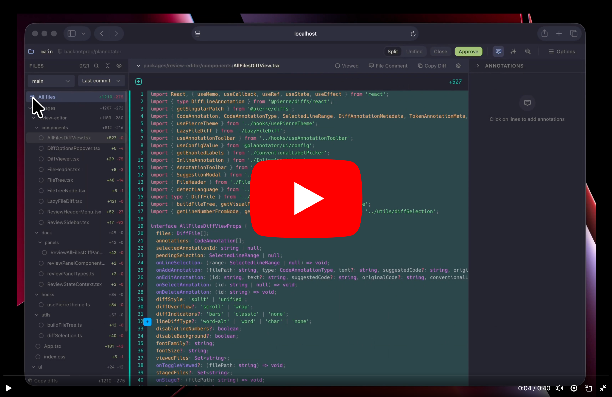
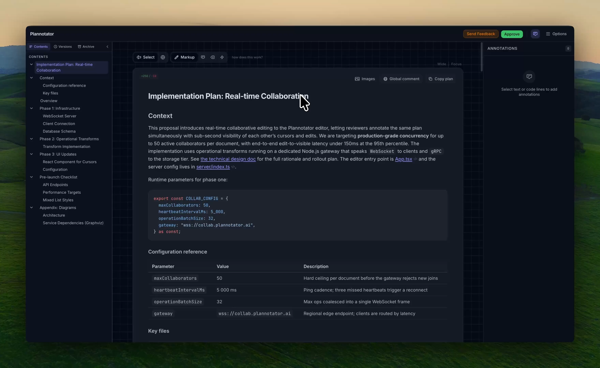
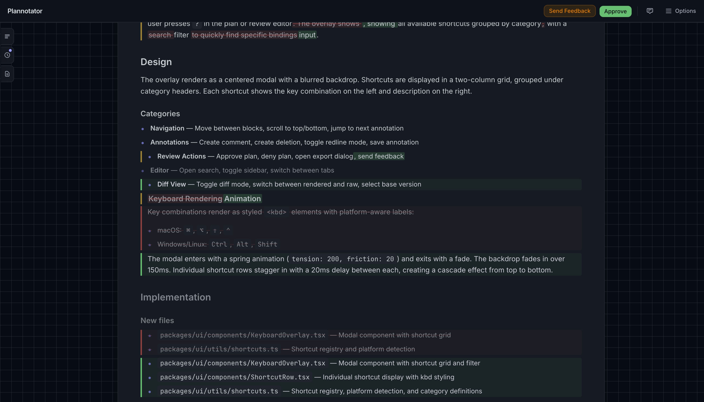

<p align="center">
  
</p>

<h1 align="center">Plannotator</h1>

<p align="center">
  <strong>Stop rubber-stamping your agent's plans.</strong>
  <br />
  Plan review, code review, and annotation for AI coding agents.
  <br />
  <em>Free. Local. Open source.</em>
</p>

<p align="center">
  <a href="https://github.com/backnotprop/plannotator"></a>
  &nbsp;
  <a href="https://plannotator.ai">Website</a>
  &nbsp;&middot;&nbsp;
  <a href="https://plannotator.ai/docs/getting-started/installation/">Docs</a>
  &nbsp;&middot;&nbsp;
  <a href="https://www.youtube.com/watch?v=a_AT7cEN_9I">Demo</a>
  &nbsp;&middot;&nbsp;
  <a href="https://share.plannotator.ai">Try it live</a>
</p>

---

Your agent writes a plan. You get a `y/n` prompt in the terminal. You skim it. You press `y`. Three minutes later you're undoing damage.

Plannotator replaces that moment with a real review workspace. Your agent's plan opens in your browser with a proper reading surface. Select text. Comment on it. Mark things for deletion. Write replacements. When you deny, your annotations go back to the agent as structured feedback it can act on. When you approve, you know what you approved.

Same idea for code: `/plannotator-review` gives you a PR-style diff viewer over your agent's uncommitted changes -- or any GitHub/GitLab PR URL. Line-level annotations, file tree, stage/unstage. The full workflow you already know from code review, applied to agent output.

Plans never leave your machine. Everything runs locally.

<p align="center">
  <a href="https://www.youtube.com/watch?v=a_AT7cEN_9I">
    
  </a>
  <br />
  <sub>2-minute demo -- Claude Code plan review in action</sub>
</p>

---

## What you get

<table>
<tr>
<td width="50%">

### Plan Review

When your agent proposes a plan, Plannotator intercepts the approval step and opens a review workspace. Annotate inline, mark deletions, write replacements. Approve or deny with structured feedback.

**Happens automatically.** No command to run.

</td>
<td width="50%">


</td>
</tr>
<tr>
<td width="50%">



</td>
<td width="50%">

### Code Review

Run `/plannotator-review` for a PR-style diff viewer. Side-by-side or unified diffs, file tree navigation, line-level annotations, stage/unstage files. Pass a GitHub or GitLab PR URL to review remote PRs too.

</td>
</tr>
<tr>
<td width="50%">

### Annotate Anything

Run `/plannotator-annotate` on any markdown file, HTML file, URL, or folder. Annotate the agent's last message with `/plannotator-last`. Your annotations become structured feedback the agent can use.

</td>
<td width="50%">



</td>
</tr>
</table>

### And also...

| Feature | What it does |
|---|---|
| **Plan Diff** | When your agent revises a plan, see exactly what changed. Color-coded rendered diff or raw git-style `+/-` view. |
| **Version History** | Every plan revision saved automatically. Browse and compare any two versions. |
| **Sharing** | Share annotated plans via URL. Small plans are encoded entirely in the hash (no server). Large plans use E2E encrypted paste (AES-256-GCM, zero-knowledge, self-hostable). |
| **Draft Auto-save** | Annotations survive server crashes and browser refreshes. |
| **VS Code Extension** | Open plans in editor tabs, view diffs inline, add annotations from the editor. |
| **Obsidian Integration** | Auto-save approved plans to your vault with YAML frontmatter and tags. |

<p align="center">
  
  &nbsp;&nbsp;
  
</p>

---

## Works with your agent

**Claude Code** &middot; **Copilot CLI** &middot; **Gemini CLI** &middot; **OpenCode** &middot; **Pi** &middot; **Codex** &middot; **VS Code**

---

## Install

### Claude Code

```bash
# macOS / Linux / WSL
curl -fsSL https://plannotator.ai/install.sh | bash

# Windows PowerShell
irm https://plannotator.ai/install.ps1 | iex
```

Then in Claude Code:

```
/plugin marketplace add backnotprop/plannotator
/plugin install plannotator@plannotator
```

Restart Claude Code after install for hooks to activate.

<details>
<summary>Manual hook setup (no plugin system)</summary>

Add to `~/.claude/settings.json`:

```json
{
  "hooks": {
    "PermissionRequest": [
      {
        "matcher": "ExitPlanMode",
        "hooks": [
          {
            "type": "command",
            "command": "plannotator",
            "timeout": 345600
          }
        ]
      }
    ]
  }
}
```

</details>

<details>
<summary>Pin a specific version or verify provenance</summary>

```bash
curl -fsSL https://plannotator.ai/install.sh | bash -s -- --version vX.Y.Z
```

Every released binary ships with a SHA256 sidecar. [SLSA provenance](https://slsa.dev/) attestations are available from v0.17.2 -- see the [installation docs](https://plannotator.ai/docs/getting-started/installation/#verifying-your-install) for verification steps.

</details>

---

### Copilot CLI

```bash
curl -fsSL https://plannotator.ai/install.sh | bash
```

Then in Copilot CLI:

```
/plugin marketplace add backnotprop/plannotator
/plugin install plannotator-copilot@plannotator
```

Restart after install. Plan review activates automatically when you use plan mode (`Shift+Tab`).

---

### Gemini CLI

```bash
curl -fsSL https://plannotator.ai/install.sh | bash
```

The installer auto-detects Gemini CLI and configures the plan review hook, policy, and slash commands. Requires Gemini CLI 0.36.0+.

```
/plan                              # Enter plan mode
/plannotator-review                # Code review for current changes
/plannotator-review <pr-url>       # Review a GitHub pull request
/plannotator-annotate <file.md>    # Annotate a markdown file
```

See [apps/gemini/README.md](apps/gemini/README.md) for details.

---

### OpenCode

Add to `opencode.json`:

```json
{
  "plugin": ["@plannotator/opencode@latest"]
}
```

Then run the install script and restart:

```bash
curl -fsSL https://plannotator.ai/install.sh | bash
```

---

### Pi

```bash
pi install npm:@plannotator/pi-extension
```

Start Pi with `--plan` for plan mode, or toggle with `/plannotator` during a session. See [apps/pi-extension/README.md](apps/pi-extension/README.md).

---

### Codex

```bash
curl -fsSL https://plannotator.ai/install.sh | bash
```

```
!plannotator review           # Code review for current changes
!plannotator review <pr-url>  # Review a GitHub pull request
!plannotator annotate file.md # Annotate a markdown file
!plannotator last             # Annotate the last agent message
```

Note: plan mode is not yet supported for Codex.

---

## How it works

### Plan review

```
Your agent proposes a plan
  --> Plannotator intercepts the approval step
  --> Browser opens with the full plan in a review workspace
  --> You annotate: comments, deletions, replacements
  --> Approve  -->  agent proceeds with your blessing
  --> Deny     -->  structured feedback sent back to the agent
  --> Agent revises  -->  plan diff shows what changed
```

### Code review

```
You run /plannotator-review
  --> git diff captures changes (or PR fetched from URL)
  --> Browser opens with a PR-style diff viewer
  --> You annotate lines, stage/unstage files
  --> Send feedback  -->  returned to your agent session
```

---

## Sharing

**Small plans** are encoded entirely in the URL hash. Nothing is stored anywhere -- no server, no database, no account. The data _is_ the link.

**Large plans** use a paste service with end-to-end encryption. The plan is encrypted with AES-256-GCM in your browser before upload. The decryption key lives only in the URL fragment (never sent to the server). The server stores ciphertext it can never read. Pastes auto-delete after 7 days.

Same model as [PrivateBin](https://privatebin.info/). The paste service is fully open source and [self-hostable](https://plannotator.ai/docs/guides/sharing-and-collaboration/).

---

## Remote / devcontainer usage

```bash
export PLANNOTATOR_REMOTE=1
export PLANNOTATOR_PORT=9999  # a port you'll forward
```

Uses a fixed port instead of a random one. VS Code devcontainers forward automatically (check the Ports tab). For SSH:

```
Host your-server
    LocalForward 9999 localhost:9999
```

---

## Integrations

| Integration | What it does |
|---|---|
| **[VS Code Extension](https://marketplace.visualstudio.com/items?itemName=backnotprop.plannotator-webview)** | Open plans in editor tabs, view diffs inline, add annotations from the editor |
| **Obsidian** | Auto-save approved plans to your vault with YAML frontmatter, tags, and backlinks |
| **Bear** | Save plans as Bear notes with nested tags and project metadata |
| **GitHub / GitLab PRs** | Pass any PR URL to `/plannotator-review` for the full diff viewer |

---

## Environment variables

| Variable | Description |
|---|---|
| `PLANNOTATOR_REMOTE` | `1`/`true` for remote mode, `0`/`false` for local, unset for SSH auto-detection |
| `PLANNOTATOR_PORT` | Fixed port (default: random locally, `19432` remote) |
| `PLANNOTATOR_BROWSER` | Custom browser to open plans in |
| `PLANNOTATOR_SHARE` | `disabled` to turn off URL sharing |
| `PLANNOTATOR_SHARE_URL` | Custom base URL for share links (self-hosted portal) |
| `PLANNOTATOR_PASTE_URL` | Base URL of the paste service API |
| `PLANNOTATOR_ORIGIN` | Override agent detection: `claude-code`, `opencode`, `codex`, `copilot-cli`, `gemini-cli` |
| `PLANNOTATOR_JINA` | `0`/`false` to disable Jina Reader for URL annotation |
| `JINA_API_KEY` | Optional Jina Reader API key for higher rate limits |

Settings can also be set in `~/.plannotator/config.json`.

---

## Development

```bash
bun install

bun run dev:hook       # Hook server (plan review)
bun run dev:review     # Review editor (code review)
bun run dev:marketing  # Marketing site
bun run dev:vscode     # VS Code extension (watch mode)
```

### Build

```bash
bun run build          # Main targets (hook + opencode)
bun run build:hook     # Single-file HTML for the hook server
bun run build:review   # Code review editor
bun run build:opencode # OpenCode plugin
bun run build:vscode   # VS Code extension
```

Build order matters -- `build:hook` copies pre-built HTML from `apps/review/dist/`. If you change review UI code, rebuild the review app first:

```bash
bun run --cwd apps/review build && bun run build:hook
```

Test locally with a compiled binary:

```bash
bun run --cwd apps/review build && bun run build:hook && \
  bun build apps/hook/server/index.ts --compile --outfile ~/.local/bin/plannotator
```

Test the plugin locally:

```bash
claude --plugin-dir ./apps/hook
```

---

## License

Copyright 2025-2026 backnotprop

Dual-licensed under [Apache 2.0](LICENSE-APACHE) or [MIT](LICENSE-MIT) at your option.

Contributions are dual-licensed under the same terms unless you explicitly state otherwise.
